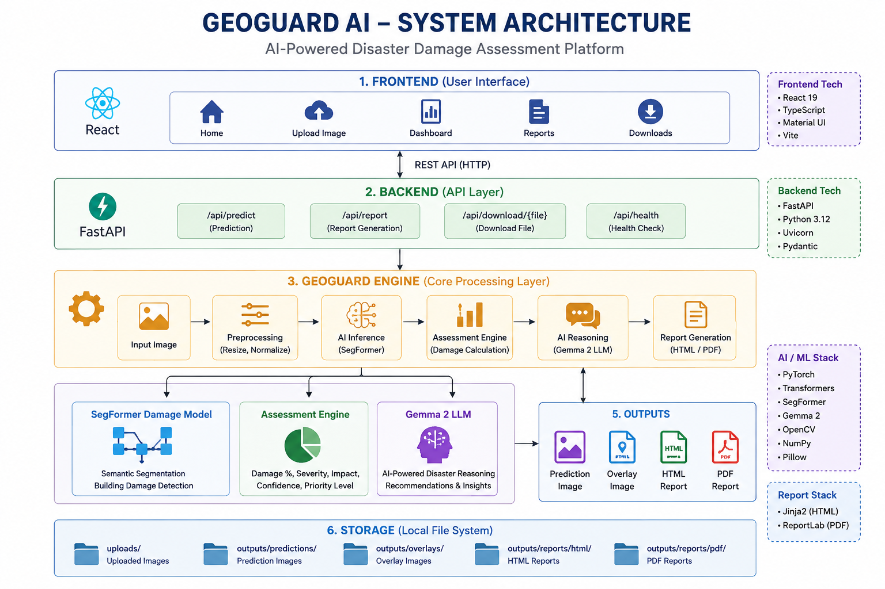

# 🌍 GeoGuard AI

### AI-Powered Disaster Damage Assessment Platform

GeoGuard AI is an AI-powered disaster damage assessment platform that analyzes satellite and aerial imagery to detect building damage, assess disaster severity, generate AI-powered reasoning using Large Language Models, and produce professional assessment reports.

The platform combines Computer Vision, Deep Learning, Large Language Models, and Full-Stack Web Development into a single intelligent disaster assessment system.


## 📖 Project Overview

Natural disasters such as earthquakes, floods, hurricanes, and cyclones can cause widespread infrastructure damage. Rapid and accurate damage assessment is essential for emergency response, disaster management, and recovery planning.

GeoGuard AI automates this process using Artificial Intelligence.

The platform processes satellite or aerial imagery through deep learning models to identify building damage, evaluates disaster severity using an assessment engine, generates AI-assisted reasoning using Google's Gemma 2 Large Language Model, and automatically produces professional HTML and PDF reports.

GeoGuard AI provides emergency responders, researchers, and decision-makers with a fast and structured understanding of disaster impact.

## ✨ Features

- 🛰️ Satellite Image Based Disaster Assessment
- 🏢 Building Damage Detection using SegFormer
- 🤖 AI Disaster Reasoning using Gemma 2
- 📊 Disaster Severity Assessment
- 📈 Damage Statistics Visualization
- 🖼️ Prediction and Overlay Image Generation
- 📄 Professional HTML Report Generation
- 📑 Professional PDF Report Generation
- 🌐 React + FastAPI Full Stack Web Application
- 📥 Download Center for Reports and Images
- 📱 Responsive User Interface


## 🛠 Technology Stack

| Category | Technologies |
|----------|--------------|
| Frontend | React, TypeScript, Vite, Material UI |
| Backend | FastAPI, Python |
| Deep Learning | PyTorch, Transformers |
| AI Model | SegFormer |
| Large Language Model | Gemma 2 |
| Image Processing | OpenCV, Pillow |
| Reports | HTML, ReportLab PDF |
| API | REST API |
| Version Control | Git, GitHub |

## 🎯 Problem Statement

Manual disaster assessment requires significant time, expert resources, and field surveys. During large-scale disasters, rapid assessment becomes difficult, delaying emergency response.

GeoGuard AI addresses this challenge by providing automated AI-based damage assessment using satellite imagery and generating structured reports that can assist emergency responders and decision-makers.

---

# 🏗️ System Architecture

<p align="center">
  
</p>

---

# 🤖 AI Processing Workflow

```
Satellite / Aerial Image
            │
            ▼
Image Upload (React)
            │
            ▼
FastAPI Prediction API
            │
            ▼
SegFormer Damage Detection
            │
            ▼
Damage Assessment Engine
            │
            ▼
Gemma 2 AI Reasoning
            │
            ▼
Professional Report Generation
            │
            ▼
Dashboard Visualization
            │
            ▼
Download HTML / PDF Reports
```

---

# 📂 Project Structure

```text
GeoGuard-AI/
│
├── backend/
│   ├── api/
│   ├── assessment/
│   ├── geoguard/
│   ├── inference/
│   ├── reasoning/
│   ├── report/
│   ├── outputs/
│   └── ...
│
├── frontend/
│   ├── public/
│   ├── src/
│   └── ...
│
├── docs/
├── sample_images/
├── screenshots/
├── scripts/
│
├── README.md
├── LICENSE
├── requirements.txt
└── .gitignore
```

---

# ⚙️ Installation

## 1. Clone Repository

```bash
git clone https://github.com/SHIVAMSALVE-12/GeoGuard-AI.git

cd GeoGuard-AI
```

---

## 2. Backend Setup

Create Virtual Environment

```bash
python -m venv venv
```

Activate Environment

### Windows

```bash
venv\Scripts\activate
```

### Linux / macOS

```bash
source venv/bin/activate
```

Install Dependencies

```bash
pip install -r requirements.txt
```

---

## 3. Frontend Setup

```bash
cd frontend

npm install
```

---

# ▶️ Running the Project

## Start Backend

```bash
uvicorn backend.api.app:app --reload
```

Backend URL

```
http://127.0.0.1:8000
```

API Documentation

```
http://127.0.0.1:8000/docs
```

---

## Start Frontend

```bash
cd frontend

npm run dev
```

Frontend URL

```
http://localhost:5173
```

---

# 🌐 API Endpoints

| Endpoint | Method | Description |
|----------|--------|-------------|
| `/api/predict` | POST | Run AI Disaster Assessment |
| `/api/download/{filename}` | GET | Download Generated Reports |
| `/api/report` | GET | Generate Professional Report |
| `/api/health` | GET | Health Check |
| `/docs` | GET | Swagger API Documentation |

---


# 📊 Dashboard Features

The GeoGuard AI dashboard provides an intuitive interface for visualizing disaster assessment results.

### Dashboard Includes

- 📌 Disaster Severity Assessment
- 📌 Disaster Impact Assessment
- 📌 AI Confidence Score
- 📌 Priority Level
- 📌 Original Uploaded Image
- 📌 AI Damage Prediction
- 📌 Damage Overlay Visualization
- 📌 AI-Generated Disaster Reasoning
- 📌 Building Damage Statistics
- 📌 HTML Report Download
- 📌 PDF Report Download

---

# 🤖 AI Reasoning

GeoGuard AI integrates **Google Gemma 2** to generate human-readable disaster assessment reports.

The Large Language Model analyzes the assessment results and provides:

- Executive Summary
- Disaster Analysis
- Priority Level
- Emergency Recommendations

This enables users to understand disaster impacts without interpreting raw model outputs.

---

# 📄 Professional Report Generation

After every assessment, GeoGuard AI automatically generates:

- 📄 Professional HTML Report
- 📑 Professional PDF Report

The reports include:

- Assessment Summary
- Disaster Severity
- Building Damage Statistics
- AI Reasoning
- Recommendations
- Generated Prediction Images

These reports can be downloaded directly from the dashboard.

---

# 🚀 Future Improvements

The following enhancements can be incorporated in future versions:

- 🌊 Flood Detection
- 🌳 Land Cover Classification
- 🔥 Wildfire Detection
- 🌪️ Multi-Disaster Assessment
- ☁️ Cloud Deployment
- 📡 Real-Time Satellite Integration
- 🗺️ GIS Mapping Support
- 📍 Interactive Disaster Maps
- 📱 Mobile Application
- 🌍 Multi-Language Support

---

# 📈 Project Highlights

| Feature | Status |
|----------|--------|
| React Frontend | ✅ |
| FastAPI Backend | ✅ |
| SegFormer Damage Detection | ✅ |
| Gemma 2 AI Reasoning | ✅ |
| Disaster Assessment Engine | ✅ |
| HTML Reports | ✅ |
| PDF Reports | ✅ |
| Interactive Dashboard | ✅ |
| Download Center | ✅ |
| Responsive UI | ✅ |

---

# 👨‍💻 Author

## Shivam Salve

### Skills

- Artificial Intelligence
- Machine Learning
- Computer Vision
- Deep Learning
- FastAPI
- React
- Python
- TypeScript
- PyTorch

GitHub:

https://github.com/SHIVAMSALVE-12

---

# ⭐ Support

If you found this project useful, consider giving it a ⭐ on GitHub.

---

# 📬 Feedback

Suggestions, improvements, and contributions are always welcome.
